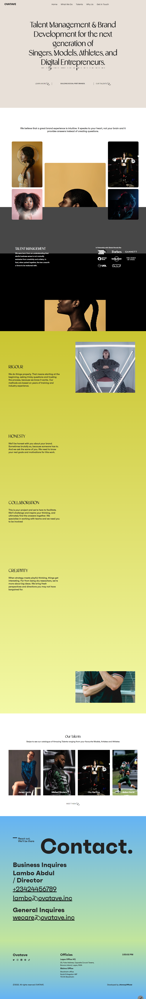

 # Ovatave - A Talent and Brand Management Agency.

This project's major objective was to showcase the agency's next generation of singers, models, athletes, and digital entrepreneurs and celebrate its success in the entertainment industry.
## Table of contents

- [Overview](#overview)
  - [The Project](#the-project)
  - [Links](#links)
- [My process](#my-process)
  - [Built with](#built-with)
- [Author](#author)

## Overview

### The Project

Major Components of the Project includes

- Optimal layout for the site depending on user's device's screen size
- Responsive gallery component
- Custom Cursor and Loader
- Interactive Animations

### Links

- Live Site URL: https://ovatave.netlify.app/

### Images of the project

### Built with

- React.Js
- GSAP
- React Router
- React Scroll
- Lottie
- CSS Media Queries
- Mobile-first workflow

## Author

- Twitter - [@jhimmyofficial](https://www.twitter.com/@jhimmyofficial)

## Running the Project

The project was bootstrapped with [Create React App](https://github.com/facebook/create-react-app).

## Available Scripts

In the project directory, you can run:

### `npm start`

Runs the app in the development mode.\
Open [http://localhost:3000](http://localhost:3000) to view it in the browser.